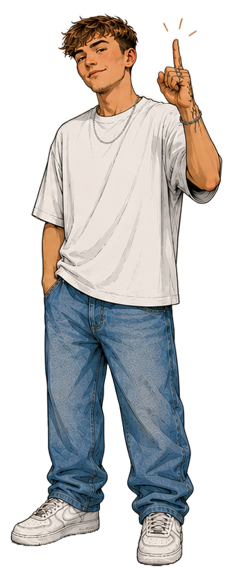

<picture>
  <source media="(prefers-color-scheme: dark)" srcset="assets/header-dark.svg" />
  <source media="(prefers-color-scheme: light)" srcset="assets/header-light.svg" />
  
</picture>

 

<table>
<tr>
<td width="62%" valign="top">

#### About

Apprentice developer working in IT. I build the things that make me curious — sometimes messy, sometimes neat, always made with intention. If a project goes well, it lands in a repo. If it goes really well, it even gets documentation.

Right now I'm going deeper on **Angular** and **.net**.

#### Stack

EDITORS & ENGINES 
<picture>
  <source media="(prefers-color-scheme: dark)" srcset="https://skillicons.dev/icons?i=visualstudio%2Cvscode%2Cidea%2Candroidstudio%2Cblender%2Cunity%2Cunreal%2Cfigma&perline=8&theme=dark" />
  <source media="(prefers-color-scheme: light)" srcset="https://skillicons.dev/icons?i=visualstudio%2Cvscode%2Cidea%2Candroidstudio%2Cblender%2Cunity%2Cunreal%2Cfigma&perline=8&theme=light" />
  
</picture>

LANGUAGES 
<picture>
  <source media="(prefers-color-scheme: dark)" srcset="https://skillicons.dev/icons?i=java%2Ccs%2Cts%2Cjs%2Cpy%2Cc%2Ccpp%2Cphp%2Cbash%2Cpowershell%2Chtml%2Ccss&perline=8&theme=dark" />
  <source media="(prefers-color-scheme: light)" srcset="https://skillicons.dev/icons?i=java%2Ccs%2Cts%2Cjs%2Cpy%2Cc%2Ccpp%2Cphp%2Cbash%2Cpowershell%2Chtml%2Ccss&perline=8&theme=light" />
  
</picture>

FRAMEWORKS 
<picture>
  <source media="(prefers-color-scheme: dark)" srcset="https://skillicons.dev/icons?i=react%2Cnextjs%2Cangular%2Cvite%2Ctailwind%2Celectron%2Cflutter%2Cnodejs%2Cexpress%2Cfastapi%2Cflask%2Cdotnet%2Cpytorch%2Ctensorflow&perline=8&theme=dark" />
  <source media="(prefers-color-scheme: light)" srcset="https://skillicons.dev/icons?i=react%2Cnextjs%2Cangular%2Cvite%2Ctailwind%2Celectron%2Cflutter%2Cnodejs%2Cexpress%2Cfastapi%2Cflask%2Cdotnet%2Cpytorch%2Ctensorflow&perline=8&theme=light" />
  
</picture>

PLATFORMS 
<picture>
  <source media="(prefers-color-scheme: dark)" srcset="https://skillicons.dev/icons?i=github%2Cgitlab%2Cvercel%2Ccloudflare%2Cfirebase%2Cgcp&perline=8&theme=dark" />
  <source media="(prefers-color-scheme: light)" srcset="https://skillicons.dev/icons?i=github%2Cgitlab%2Cvercel%2Ccloudflare%2Cfirebase%2Cgcp&perline=8&theme=light" />
  
</picture>

TOOLS & DATA 
<picture>
  <source media="(prefers-color-scheme: dark)" srcset="https://skillicons.dev/icons?i=git%2Cmysql%2Cpostgres%2Csqlite%2Cdocker%2Cnginx%2Clinux%2Craspberrypi&perline=8&theme=dark" />
  <source media="(prefers-color-scheme: light)" srcset="https://skillicons.dev/icons?i=git%2Cmysql%2Cpostgres%2Csqlite%2Cdocker%2Cnginx%2Clinux%2Craspberrypi&perline=8&theme=light" />
  
</picture>

</td>
<td width="38%" align="center" valign="bottom">

</td>
</tr>
</table>

#### Activity

<picture>
  <source media="(prefers-color-scheme: dark)" srcset="https://streak-stats.demolab.com/?user=johanneshehl&background=000000&border=262626&stroke=262626&ring=FFFFFF&fire=FFFFFF&currStreakNum=FFFFFF&sideNums=FFFFFF&currStreakLabel=A1A1A1&sideLabels=A1A1A1&dates=737373&border_radius=12" />
  <source media="(prefers-color-scheme: light)" srcset="https://streak-stats.demolab.com/?user=johanneshehl&background=FFFFFF&border=EAEAEA&stroke=EAEAEA&ring=000000&fire=000000&currStreakNum=000000&sideNums=000000&currStreakLabel=666666&sideLabels=666666&dates=8F8F8F&border_radius=12" />
  
</picture>

#### Contact

<picture><source media="(prefers-color-scheme: dark)" srcset="assets/contact-discord-dark.svg" /><source media="(prefers-color-scheme: light)" srcset="assets/contact-discord-light.svg" /></picture>
<a href="https://buymeacoffee.com/St4ndd"><picture><source media="(prefers-color-scheme: dark)" srcset="assets/contact-coffee-dark.svg" /><source media="(prefers-color-scheme: light)" srcset="assets/contact-coffee-light.svg" /></picture></a>

